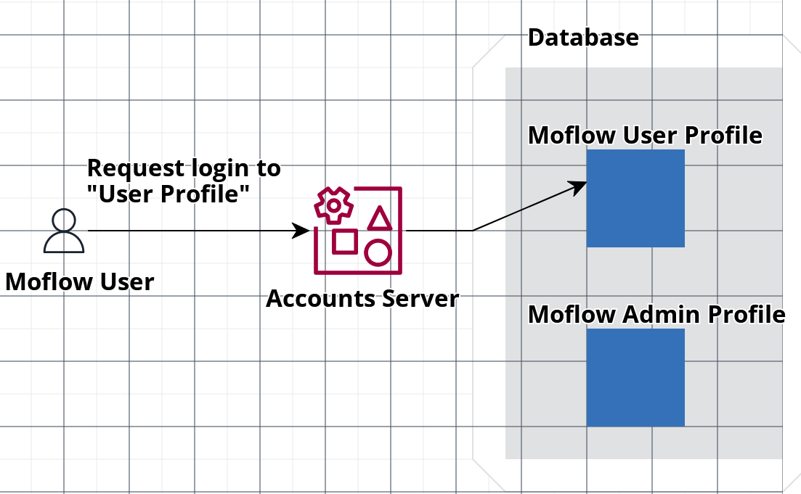

# Spring Security With JWT

## Purpose
- Utilizing multiple profiles with a single account
- e.g.) Envisioning a multi-profile environment in a single service, allowing users to **Log in as a Seller**, **Log in as a Buyer**, etc.

## Improvements
AS-IS
- Many existing login methods don't include the concept of a profile, storing both seller and buyer permissions in a single user information.

TO-BE
- Creating and using multiple profiles with the same login account information.

- Logging in with the profile information chosen at the time of login.



## Implementation Details
- Simple authentication and authorization implemented through Spring Security and JWT
- Roles include ADMIN and USER
- Using docker-compose for Docker container management
- Customized Exception Handler for project-specific handling
- Employing key rolling technology to create accessTokens using multiple keys
- Selecting desired Role when logging in
    - Utilizing the [joinUsernameAndRole] function to include the desired ROLE in [username] passed to the [loadUserByUsername] method of the [Userdetails] class
- Users may have multiple Profiles, each of which may have a single permission

## How to Run

```
# project build
./gradlew clean build

# docker build and run
docker-compose build --no-cache & docker-compose up
```
